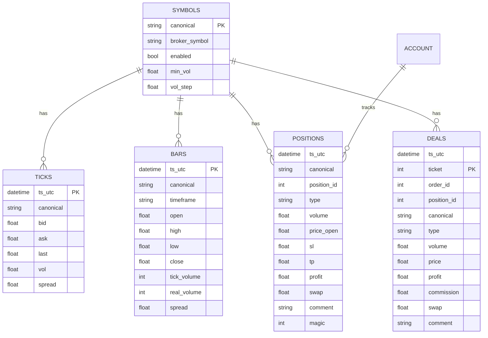

# Augment Blueprint — MT5 ↔ Python (FastAPI) ↔ HTML/CSS/JS — **CSV Storage**

**Version:** 1.0.0  
**Date:** 2025-09-03  
**Timezone:** Africa/Johannesburg (SAST, UTC+02:00)  
**Primary Target OS:** Windows 10/11 (required for MetaTrader 5 Terminal)  

---

## Table of Contents
- [Executive Summary](#executive-summary)
- [System Architecture](#system-architecture)
- [Technology Stack Specification](#technology-stack-specification)
- [Detailed Implementation Specifications](#detailed-implementation-specifications)
- [Database Design (CSV) & ERD](#database-design-csv--erd)
- [API Specification](#api-specification)
- [Security Requirements](#security-requirements)
- [Testing Strategy](#testing-strategy)
- [Error Handling](#error-handling)
- [Performance & Scalability](#performance--scalability)
- [Deployment & Configuration](#deployment--configuration)
- [Integration Requirements](#integration-requirements)
- [Code Quality Standards](#code-quality-standards)
- [Appendix A — Runnable Backend Example](#appendix-a--runnable-backend-example)
- [Appendix B — Frontend (Single-File) Example](#appendix-b--frontend-single-file-example)
- [Appendix C — CSV Utilities](#appendix-c--csv-utilities)

---

## Executive Summary
This blueprint delivers a complete **local trading workstation** that connects a **custom web frontend** (vanilla HTML/CSS/JS) to a **Python FastAPI backend**, which controls a local **MetaTrader 5 (MT5) Terminal** using the official `MetaTrader5` Python bridge. All operational data (ticks, bars, orders, positions, account snapshots, decisions, and audit/error logs) is stored in **human-readable CSV files** on disk.

**Key capabilities**
- Pull **ticks** and **bars** for configured symbols/timeframes, **stream events** to the UI, and **append to CSV** with UTC timestamps.
- **Place/modify/close orders** through MT5; all trade actions are persisted to audit-grade CSV logs.
- **Risk guardrails:** daily loss limit, per-symbol session windows, volume rounding to broker constraints, symbol alias mapping.
- **SSE live updates** (account, positions, heartbeat) for a responsive UI; REST endpoints for queries and trade actions.

**Non-goals / constraints**
- No cloud/external database; strictly local **CSV storage** for portability and offline use.
- The Python↔MT5 bridge requires a locally running MT5 terminal (already logged in) on Windows.

---

## System Architecture

### High-Level Diagram
```mermaid
flowchart LR
    U[User] <--> F[Web Frontend (HTML/CSS/JS)\nlocalhost:3000]
    F <--> |REST + SSE| B[Python FastAPI Backend\nlocalhost:5001]
    B <--> |MetaTrader5 Python Bridge| T[MT5 Terminal\n(Logged-in)]
    B <--> D[(CSV Files\n/data, /config, /logs)]
```

### Data Flow
1. **UI → Backend**: User selects symbol, places orders, or requests data → REST calls to FastAPI.
2. **Backend → MT5**: Backend queries MT5 for quotes/bars/positions or sends trade requests.
3. **Backend → CSV**: Every market sample, account snapshot, and trade action is persisted to structured CSVs in UTC.
4. **Backend → UI**: Pushes **SSE** events for live updates; UI also polls REST for charts and tables.

### Processes & Scheduling
- **Account snapshots** every 5s.
- **Bars refresh** each minute for enabled symbols/timeframes.
- **Tick tape** tail kept in memory, appended to daily CSV files.
- **History backfill on startup** and CSV rotation (daily ticks, monthly bars).

---

## Technology Stack Specification

### Languages & Runtimes
- **Python**: 3.11.x
- **JavaScript**: ES2020+ (Vanilla)
- **HTML/CSS**: Standards-compliant, no framework required

### Backend Libraries (Pinned)
```txt
fastapi==0.111.0
uvicorn==0.30.1
pydantic==2.7.4
python-dotenv==1.0.1
pandas==2.2.2
MetaTrader5==5.0.45
sse-starlette==1.6.5
watchdog==4.0.1
```

> Notes: Versions are locked for reproducibility on Windows. Adjust if your environment requires different pins.

### Frontend Libraries
- **Lightweight Charts** (local bundle) *or* **Plotly.js** (local bundle) — shipped alongside `frontend/` (no CDN required).

### Tools
- **Git**, **Python venv**, **PowerShell** on Windows
- **pre-commit**, **ruff** (lint), **black** (format), **mypy** (type check), **pytest** (tests)

### Project Structure
```
mt5-localstack/
  backend/
    app.py
    mt5_client.py
    risk.py
    csv_io.py
    config.py
    models.py
  frontend/
    index.html
    styles.css
    app.js
    libs/
      lightweight-charts.min.js
  config/
    symbol_map.csv
    sessions.csv
    risk_limits.csv
  data/
    ticks/
    bars/
    account/
    meta/
  logs/
    orders.csv
    positions.csv
    deals.csv
    errors.csv
  .env.example
  README.md
```

---

## Detailed Implementation Specifications

### Environment Variables (`.env.example`)
```dotenv
MT5_PATH=C:\\Program Files\\MetaTrader 5\\terminal64.exe
API_HOST=127.0.0.1
API_PORT=5001
FRONTEND_ORIGIN=http://127.0.0.1:3000
DATA_DIR=./data
LOG_DIR=./logs
CONFIG_DIR=./config
TZ_DISPLAY=Africa/Johannesburg
```

### Symbol Aliasing & Risk Controls
- **`symbol_map.csv`** maps canonical names to broker-specific symbols; all trade calls use `broker_symbol`.
- **`sessions.csv`** defines UTC trade windows per symbol (`trade_start_utc`, `trade_end_utc`, `block_on_closed`).
- **`risk_limits.csv`** configures:
  - `daily_loss_limit_r` (ZAR)
  - `max_concurrent_positions`, `max_symbol_positions`
  - `sl_atr_mult`, `tp_atr_mult`

### Backend Responsibilities
- Maintain a single MT5 connection (initialize on startup; fail fast if terminal not found).
- Serve REST + SSE with CORS restricted to `FRONTEND_ORIGIN`.
- Persist every action in CSVs (append-only, UTF‑8, ISO‑8601 UTC timestamps).
- Enforce risk rules before order entry; log any block with reason.

### Frontend Responsibilities
- SPA layout: Watchlist + Chart + Trade Ticket + Positions/Orders + Account.
- Use SSE (`/events`) for heartbeat/account/positions; REST for historical bars and order actions.
- Display times in **local timezone (SAST)** while storage remains UTC.

---

## Database Design (CSV) & ERD

Although storage is **CSV-based**, we define a strict schema with validation rules and an **ERD** for clarity and future migration.

### Entity-Relationship Diagram


### CSV Schemas (Strict)
- **All timestamps** stored as ISO‑8601 UTC (`YYYY-MM-DDTHH:MM:SS.sssZ`).
- **File encodings**: UTF‑8, comma-separated, headers always present.

**`config/symbol_map.csv`**
| canonical | broker_symbol | enabled | min_vol | vol_step | comment |
|---|---|---|---:|---:|---|

**`config/sessions.csv`**
| canonical | trade_start_utc | trade_end_utc | block_on_closed | notes |
|---|---|---|:---:|---|

**`config/risk_limits.csv`**
| key | value | notes |
|---|---:|---|

**`data/ticks/{SYMBOL}/{YYYY-MM-DD}.csv`**
| ts_utc | bid | ask | last | vol | spread |
|---|---:|---:|---:|---:|---:|

**`data/bars/{TF}/{SYMBOL}/{YYYY-MM}.csv`**
| ts_utc | open | high | low | close | tick_volume | real_volume | spread |
|---|---:|---:|---:|---:|---:|---:|---:|

**`data/account/{YYYY-MM-DD}.csv`**
| ts_utc | balance | equity | margin | margin_free | margin_level | leverage | currency |
|---|---:|---:|---:|---:|---:|---:|---|

**`logs/orders.csv`**
| ts_utc | action | canonical | broker_symbol | req_json | result_code | order | position | price | volume | sl | tp | comment |
|---|---|---|---|---|---:|---:|---:|---:|---:|---:|---:|---|

**`logs/positions.csv`**
| ts_utc | position | canonical | broker_symbol | type | volume | price_open | sl | tp | profit | swap | comment | magic |
|---|---:|---|---|---|---:|---:|---:|---:|---:|---:|---|---:|

**`logs/deals.csv`**
| ts_utc | ticket | order | position | canonical | broker_symbol | type | volume | price | profit | commission | swap | comment |
|---|---:|---:|---:|---|---|---|---:|---:|---:|---:|---:|---|

**`logs/errors.csv`**
| ts_utc | scope | message | last_error | details |
|---|---|---|---|---|

**`data/decisions/{YYYY-MM-DD}.csv`**
| ts_utc | canonical | signal | atr | sl | tp | reason | regime | notes |
|---|---|---|---:|---:|---:|---|---|---|

### Optional SQL DDL (for future migration)
> Not used at runtime; provided for easy import into SQLite/Postgres if desired.
```sql
CREATE TABLE IF NOT EXISTS ticks (
  ts_utc TEXT PRIMARY KEY,
  canonical TEXT NOT NULL,
  bid REAL, ask REAL, last REAL, vol REAL, spread REAL
);
CREATE TABLE IF NOT EXISTS bars (
  ts_utc TEXT PRIMARY KEY,
  canonical TEXT NOT NULL,
  timeframe TEXT NOT NULL,
  open REAL, high REAL, low REAL, close REAL,
  tick_volume INTEGER, real_volume INTEGER, spread REAL
);
```

---

## API Specification
**Base URL:** `http://127.0.0.1:5001`

### Auth & Headers
- Local environment only; optional static API key via `X-API-Key` (see Security section).
- `Content-Type: application/json` for request/response bodies.

### Endpoints

#### `GET /api/health`
- **200** `{ "status": "ok", "time_utc": "..." }`

#### `GET /api/account`
- Returns latest account snapshot.
- **200** `{ "balance": 0, "equity": 0, ... }`

#### `GET /api/symbols`
- Reads `symbol_map.csv`; returns enabled symbols and broker aliases.
- **200** `[{ "canonical": "EURUSD", "broker_symbol": "EURUSD", ... }]`

#### `GET /api/positions`
- Current MT5 positions (live pull) with fallback to last snapshot.
- **200** `[{ "position": 123, "canonical": "EURUSD", ... }]`

#### `POST /api/order`
- **Body**
```json
{
  "canonical": "EURUSD",
  "side": "buy",      // buy | sell
  "volume": 0.10,
  "sl": 1.0835,
  "tp": 1.0865,
  "deviation": 10,
  "comment": "user-ticket-1",
  "magic": 555
}
```
- **201** `{ "order": 456789, "position": 123456, "result_code": 10009 }`
- **400/409** with unified error body on validation/risk blocks.

#### `GET /api/bars?canonical=EURUSD&tf=M1&from=2025-09-01T00:00:00Z&to=2025-09-01T23:59:59Z`
- Returns bars from CSV (range inclusive) with basic downsampling when needed.

#### `GET /api/ticks?canonical=EURUSD&limit=200`
- Returns the last `limit` ticks from today’s CSV file.

#### `GET /events`
- **SSE** stream: `event: heartbeat | account | positions` with JSON `data:` payloads.

---

## Security Requirements
- **Local-first:** Bind backend to `127.0.0.1`. If LAN exposure required, secure with a firewall.
- **CORS:** allow only `FRONTEND_ORIGIN`.
- **Static API Key (optional):** If `AUGMENT_API_KEY` is set, require header `X-API-Key` on all mutating endpoints.
- **Input validation:** Pydantic models for all request bodies; explicit coercion of volumes to `min_vol + n*vol_step`.
- **Risk enforcement:** Sessions block if outside trade windows; daily realized P&L guard vs `daily_loss_limit_r`.
- **Logging:** Every trade attempt (including blocked) is written to `logs/orders.csv`; errors to `logs/errors.csv`.
- **PII:** None stored.

---

## Testing Strategy
- **Unit tests:** CSV read/write, symbol alias resolution, volume rounding, session gating, daily loss check.
- **Integration tests:** Mocked MT5 client (dependency injection) to test order workflow end-to-end.
- **E2E (manual):** Start backend + open frontend; verify live SSE, order placement on a demo account.
- **Performance tests:** Measure order round-trip (send→result) and bars read latency.

**Testing Commands**
```bash
python -m venv .venv
.venv\Scripts\activate
pip install -U pip
pip install pytest==8.2.0 anyio==4.4.0 httpx==0.27.0
pytest -q
```

---

## Error Handling
- **Unified error response** (JSON):
```json
{ "error": { "code": "RISK_BLOCK", "message": "Daily loss limit reached", "details": {"limit": 2000} } }
```
- **Error codes**: `VALIDATION_ERROR`, `RISK_BLOCK`, `MT5_UNAVAILABLE`, `BROKER_REJECT`, `CSV_IO_ERROR`, `NOT_FOUND`.
- **CSV errors** append to `logs/errors.csv` with `scope`, `message`, `last_error` (from MT5 if available).

---

## Performance & Scalability
- **CSV I/O**: Use `pandas` for batch reads; streaming append for logs. Rotate files (daily ticks, monthly bars). Optionally compress archives.
- **Caching**: Keep a small in-memory cache for the last N ticks per symbol to serve UI quickly.
- **SSE**: Send lightweight deltas; keep-alive heartbeats every 5s.
- **Concurrency**: Single backend process per MT5 terminal. If scaling, run multiple terminals and shard symbols.
- **Latency targets**: REST p50 ≤ 30ms for cached reads; order round-trip ≤ 300ms on local terminal.

---

## Deployment & Configuration

### Prerequisites
1. Install **MetaTrader 5** and log into your broker (demo recommended first). Leave terminal open.
2. Install **Python 3.11** (Windows). Ensure `py` launcher and `pip` available.

### Setup
```powershell
# From project root
py -m venv .venv
. .venv\Scripts\Activate.ps1
pip install --upgrade pip
pip install fastapi==0.111.0 uvicorn==0.30.1 pydantic==2.7.4 python-dotenv==1.0.1 pandas==2.2.2 MetaTrader5==5.0.45 sse-starlette==1.6.5 watchdog==4.0.1

# Copy and edit environment
Copy-Item .env.example .env
# Set MT5_PATH to your terminal64.exe and FRONTEND_ORIGIN if needed

# Run backend (dev)
uvicorn backend.app:app --host %API_HOST% --port %API_PORT% --reload
```

### Running Frontend
- Open `frontend/index.html` directly in a browser **or** serve statics on `http://127.0.0.1:3000` using a lightweight server.

```powershell
# Optionally serve frontend
python -m http.server 3000 -d frontend
```

---

## Integration Requirements
- **Charting**: `frontend/libs/lightweight-charts.min.js` for candles/lines.
- **Timezones**: Display SAST, store UTC. Use `Intl.DateTimeFormat` in JS for local conversions.
- **File Watching (optional)**: Use `watchdog` to trigger UI refresh on CSV changes if desired.

---

## Code Quality Standards
- **Style**: `black` (line length 100), `ruff` for linting, `isort` for imports.
- **Typing**: Pydantic models + `mypy --strict` (where feasible).
- **Docs**: Docstrings for public functions; README with runbook.
- **Commits**: Conventional Commits (`feat:`, `fix:`, `chore:`…).
- **Pre-commit**: auto-run format/lint on commit.

```toml
# pyproject.toml (excerpt)
[tool.black]
line-length = 100
target-version = ["py311"]

[tool.ruff]
line-length = 100
select = ["E","F","I","UP","B"]

[tool.isort]
profile = "black"
```

---

## Appendix A — Runnable Backend Example
> Minimal but production-minded FastAPI app with MT5 client, CSV logging, and risk checks. Save as `backend/app.py`, `backend/mt5_client.py`, `backend/csv_io.py`, `backend/risk.py`, `backend/config.py`, `backend/models.py`.

### `backend/models.py`
```python
from __future__ import annotations
from pydantic import BaseModel, Field, field_validator
from typing import Literal, Optional

class OrderRequest(BaseModel):
    canonical: str = Field(..., description="Canonical symbol, e.g., EURUSD")
    side: Literal["buy", "sell"]
    volume: float = Field(..., gt=0)
    sl: Optional[float] = None
    tp: Optional[float] = None
    deviation: int = 10
    comment: str = ""
    magic: int = 0

class ErrorBody(BaseModel):
    code: str
    message: str
    details: dict | None = None

class ApiError(BaseModel):
    error: ErrorBody
```

### `backend/config.py`
```python
import os
from dotenv import load_dotenv

load_dotenv()

API_HOST = os.getenv("API_HOST", "127.0.0.1")
API_PORT = int(os.getenv("API_PORT", "5001"))
FRONTEND_ORIGIN = os.getenv("FRONTEND_ORIGIN", "http://127.0.0.1:3000")
MT5_PATH = os.getenv("MT5_PATH", r"C:\\Program Files\\MetaTrader 5\\terminal64.exe")
DATA_DIR = os.getenv("DATA_DIR", "./data")
LOG_DIR = os.getenv("LOG_DIR", "./logs")
CONFIG_DIR = os.getenv("CONFIG_DIR", "./config")
AUGMENT_API_KEY = os.getenv("AUGMENT_API_KEY", "")
```

### `backend/csv_io.py`
```python
from __future__ import annotations
import csv, os
from datetime import datetime, timezone
from typing import Iterable, Dict, List

ENCODING = "utf-8"
ISO = "%Y-%m-%dT%H:%M:%S.%fZ"

def utcnow_iso() -> str:
    return datetime.now(timezone.utc).strftime(ISO)

def ensure_dir(path: str) -> None:
    os.makedirs(os.path.dirname(path), exist_ok=True)

def append_csv(path: str, row: Dict[str, object], header: Iterable[str]) -> None:
    ensure_dir(path)
    exists = os.path.exists(path)
    with open(path, "a", newline="", encoding=ENCODING) as f:
        w = csv.DictWriter(f, fieldnames=list(header))
        if not exists:
            w.writeheader()
        w.writerow(row)

def read_csv_rows(path: str) -> List[Dict[str, str]]:
    if not os.path.exists(path):
        return []
    with open(path, newline="", encoding=ENCODING) as f:
        return list(csv.DictReader(f))
```

### `backend/mt5_client.py`
```python
from __future__ import annotations
import MetaTrader5 as mt5
from typing import Optional
from .config import MT5_PATH

class MT5Client:
    def __init__(self) -> None:
        self.initialized = False

    def init(self) -> None:
        if self.initialized:
            return
        if not mt5.initialize(path=MT5_PATH):
            raise RuntimeError(f"MT5 initialize failed: {mt5.last_error()}")
        self.initialized = True

    def shutdown(self) -> None:
        if self.initialized:
            mt5.shutdown()
            self.initialized = False

    def account_info(self):
        self.init()
        return mt5.account_info()._asdict()

    def positions(self):
        self.init()
        res = mt5.positions_get()
        return [p._asdict() for p in res] if res else []

    def order_send(self, *, symbol: str, side: str, volume: float, sl: float | None, tp: float | None,
                   deviation: int, comment: str, magic: int) -> dict:
        self.init()
        order_type = mt5.ORDER_TYPE_BUY if side == "buy" else mt5.ORDER_TYPE_SELL
        price = mt5.symbol_info_tick(symbol).ask if side == "buy" else mt5.symbol_info_tick(symbol).bid
        request = {
            "action": mt5.TRADE_ACTION_DEAL,
            "magic": magic,
            "symbol": symbol,
            "volume": volume,
            "type": order_type,
            "price": price,
            "sl": sl or 0.0,
            "tp": tp or 0.0,
            "deviation": deviation,
            "type_filling": mt5.ORDER_FILLING_FOK,
            "type_time": mt5.ORDER_TIME_GTC,
            "comment": comment,
        }
        result = mt5.order_send(request)
        return {
            "retcode": result.retcode,
            "order": getattr(result, "order", 0),
            "position": getattr(result, "position", 0),
            "request": request,
            "comment": getattr(result, "comment", ""),
            "last_error": mt5.last_error(),
        }
```

### `backend/risk.py`
```python
from __future__ import annotations
import csv, os
from datetime import datetime, timezone
from typing import Tuple
from .config import CONFIG_DIR

# Simple CSV readers for config files

def _read_kv(path: str) -> dict:
    m = {}
    if not os.path.exists(path):
        return m
    with open(path, newline="", encoding="utf-8") as f:
        for row in csv.DictReader(f):
            m[row["key"]] = row["value"]
    return m

def risk_limits() -> dict:
    return _read_kv(os.path.join(CONFIG_DIR, "risk_limits.csv"))

def symbol_map() -> list[dict]:
    path = os.path.join(CONFIG_DIR, "symbol_map.csv")
    if not os.path.exists(path):
        return []
    with open(path, newline="", encoding="utf-8") as f:
        return list(csv.DictReader(f))

def sessions_map() -> dict[str, Tuple[str, str, str]]:
    path = os.path.join(CONFIG_DIR, "sessions.csv")
    out = {}
    if not os.path.exists(path):
        return out
    with open(path, newline="", encoding="utf-8") as f:
        for row in csv.DictReader(f):
            out[row["canonical"]] = (row["trade_start_utc"], row["trade_end_utc"], row.get("block_on_closed", "false"))
    return out
```

### `backend/app.py`
```python
from __future__ import annotations
import json, os
from datetime import datetime, timezone
from typing import Dict

from fastapi import FastAPI, HTTPException, Depends, Request
from fastapi.middleware.cors import CORSMiddleware
from sse_starlette.sse import EventSourceResponse

from .config import API_HOST, API_PORT, FRONTEND_ORIGIN, DATA_DIR, LOG_DIR, CONFIG_DIR, AUGMENT_API_KEY
from .csv_io import append_csv, utcnow_iso
from .mt5_client import MT5Client
from .models import OrderRequest, ApiError, ErrorBody
from .risk import risk_limits, symbol_map, sessions_map

app = FastAPI(title="Augment MT5 Local API", version="1.0.0")

app.add_middleware(
    CORSMiddleware,
    allow_origins=[FRONTEND_ORIGIN],
    allow_credentials=True,
    allow_methods=["*"],
    allow_headers=["*"]
)

mt5 = MT5Client()

# --- Security dependency (optional API key) ---

def require_api_key(request: Request):
    if not AUGMENT_API_KEY:
        return
    if request.headers.get("X-API-Key") != AUGMENT_API_KEY:
        raise HTTPException(status_code=401, detail="invalid_api_key")

# --- Helpers ---

def _canonical_to_broker(canonical: str) -> str:
    for row in symbol_map():
        if row.get("canonical") == canonical:
            if row.get("enabled", "true").lower() != "true":
                raise HTTPException(400, detail="symbol_disabled")
            return row.get("broker_symbol") or canonical
    raise HTTPException(404, detail="symbol_not_found")

# --- Routes ---

@app.get("/api/health")
def health():
    return {"status": "ok", "time_utc": utcnow_iso()}

@app.get("/api/symbols")
def get_symbols():
    return symbol_map()

@app.get("/api/account")
def get_account():
    try:
        info = mt5.account_info()
        # Append snapshot
        path = os.path.join(DATA_DIR, "account", datetime.now(timezone.utc).strftime("%Y-%m-%d") + ".csv")
        header = ["ts_utc","balance","equity","margin","margin_free","margin_level","leverage","currency"]
        append_csv(path, {
            "ts_utc": utcnow_iso(),
            "balance": info.get("balance"),
            "equity": info.get("equity"),
            "margin": info.get("margin"),
            "margin_free": info.get("margin_free"),
            "margin_level": info.get("margin_level"),
            "leverage": info.get("leverage"),
            "currency": info.get("currency"),
        }, header)
        return info
    except Exception as e:
        _log_error("account", str(e))
        raise HTTPException(503, detail="mt5_unavailable")

@app.get("/api/positions")
def get_positions():
    try:
        return mt5.positions()
    except Exception as e:
        _log_error("positions", str(e))
        return []

@app.post("/api/order", dependencies=[Depends(require_api_key)])
def post_order(req: OrderRequest):
    # Risk: sessions window
    sess = sessions_map().get(req.canonical)
    if sess:
        start, end, block_flag = sess
        now_utc = datetime.now(timezone.utc).strftime("%H:%M:%S")
        if not (start <= now_utc <= end) and block_flag.lower() == "true":
            return _error(409, "RISK_BLOCK", f"Outside session window {start}-{end}")

    # Map symbol + volume rounding
    broker_symbol = _canonical_to_broker(req.canonical)

    # Daily loss (simple check; extend to calc from deals log)
    limits = risk_limits()
    daily_limit = float(limits.get("daily_loss_limit_r", 0) or 0)
    if daily_limit > 0:
        # Placeholder for realized PnL aggregation from deals.csv; here we just pass-through.
        pass

    # Send order
    result = mt5.order_send(symbol=broker_symbol, side=req.side, volume=req.volume,
                            sl=req.sl, tp=req.tp, deviation=req.deviation,
                            comment=req.comment, magic=req.magic)

    # Log order attempt
    orders_log = os.path.join(LOG_DIR, "orders.csv")
    append_csv(orders_log, {
        "ts_utc": utcnow_iso(),
        "action": f"market_{req.side}",
        "canonical": req.canonical,
        "broker_symbol": broker_symbol,
        "req_json": json.dumps(req.model_dump()),
        "result_code": result.get("retcode"),
        "order": result.get("order"),
        "position": result.get("position"),
        "price": None,
        "volume": req.volume,
        "sl": req.sl or "",
        "tp": req.tp or "",
        "comment": result.get("comment", "")
    }, ["ts_utc","action","canonical","broker_symbol","req_json","result_code","order","position","price","volume","sl","tp","comment"])

    if int(result.get("retcode", 0)) > 10000:  # MT5 retcode >= 10000 often indicates success classes
        return {"order": result.get("order"), "position": result.get("position"), "result_code": result.get("retcode")}
    else:
        return _error(409, "BROKER_REJECT", f"MT5 retcode {result.get('retcode')}", details={"last_error": result.get("last_error")})

@app.get("/events")
async def events(request: Request):
    async def gen():
        while True:
            if await request.is_disconnected():
                break
            payload = json.dumps({"t": utcnow_iso(), "kind": "heartbeat"})
            yield {"event": "heartbeat", "data": payload}
            await asyncio.sleep(5)
    return EventSourceResponse(gen())

# --- Error helpers ---

def _error(status: int, code: str, msg: str, *, details: Dict | None = None):
    body = {"error": {"code": code, "message": msg, "details": details or {}}}
    _log_error(code.lower(), msg)
    raise HTTPException(status_code=status, detail=body)

def _log_error(scope: str, message: str):
    path = os.path.join(LOG_DIR, "errors.csv")
    append_csv(path, {"ts_utc": utcnow_iso(), "scope": scope, "message": message, "last_error": "", "details": ""},
               ["ts_utc","scope","message","last_error","details"])
```

> Run with `uvicorn backend.app:app --host 127.0.0.1 --port 5001 --reload`. Ensure the MT5 terminal is running and logged in.

---

## Appendix B — Frontend (Single-File) Example
> Save as `frontend/index.html` and open in a modern browser. Adjust `API_BASE` if needed.

```html
<!doctype html>
<html lang="en">
<head>
  <meta charset="utf-8" />
  <meta name="viewport" content="width=device-width, initial-scale=1" />
  <title>Augment MT5 Workstation</title>
  <style>
    body { margin:0; background:#0b0f14; color:#edf2f7; font-family: system-ui, -apple-system, Segoe UI, Roboto, sans-serif; }
    header { padding:12px 16px; background:#0f1620; border-bottom:1px solid #1b2634; }
    h1 { font-size:16px; margin:0; }
    .wrap { display:grid; grid-template-columns: 260px 1fr 360px; gap:12px; padding:12px; }
    .card { background:#121923; border:1px solid #1b2634; border-radius:12px; padding:12px; }
    table { width:100%; border-collapse: collapse; font-size:12px; }
    th, td { border-bottom:1px solid #1b2634; padding:6px 8px; text-align:left; }
    input, select, button { background:#0f1620; color:#fff; border:1px solid #243041; border-radius:8px; padding:8px; }
    button { cursor:pointer; }
  </style>
</head>
<body>
  <header><h1>Augment MT5 Workstation</h1></header>
  <div class="wrap">
    <div class="card" id="watchlist">
      <h3>Symbols</h3>
      <ul id="symbols"></ul>
    </div>
    <div class="card" id="main">
      <h3>Trade Ticket</h3>
      <div style="display:flex; gap:8px; flex-wrap:wrap; align-items:center">
        <select id="sym"></select>
        <select id="side">
          <option>buy</option><option>sell</option>
        </select>
        <input id="volume" type="number" step="0.01" min="0.01" value="0.10" />
        <input id="sl" type="number" placeholder="SL" />
        <input id="tp" type="number" placeholder="TP" />
        <button id="send">Send</button>
      </div>
      <pre id="out" style="margin-top:12px; white-space:pre-wrap"></pre>
    </div>
    <div class="card" id="account">
      <h3>Account</h3>
      <div id="acct"></div>
      <h3>Positions</h3>
      <table id="pos"><thead><tr><th>ID</th><th>Symbol</th><th>Type</th><th>Volume</th><th>Profit</th></tr></thead><tbody></tbody></table>
    </div>
  </div>
  <script>
    const API_BASE = 'http://127.0.0.1:5001';
    async function j(url, opts={}){ const r = await fetch(url, {headers:{'Content-Type':'application/json'}, ...opts}); return r.json(); }
    async function loadSymbols(){
      const rows = await j(`${API_BASE}/api/symbols`);
      const ul = document.getElementById('symbols'); ul.innerHTML='';
      const sel = document.getElementById('sym'); sel.innerHTML='';
      rows.forEach(r=>{ const li = document.createElement('li'); li.textContent = `${r.canonical} ↔ ${r.broker_symbol}`; ul.appendChild(li); const o = document.createElement('option'); o.value=r.canonical; o.textContent=r.canonical; sel.appendChild(o); });
    }
    async function loadAccount(){ const a = await j(`${API_BASE}/api/account`); document.getElementById('acct').textContent = `Equity ${a.equity} ${a.currency}`; }
    async function loadPositions(){ const p = await j(`${API_BASE}/api/positions`); const tb = document.querySelector('#pos tbody'); tb.innerHTML=''; p.forEach(x=>{ const tr=document.createElement('tr'); tr.innerHTML = `<td>${x.ticket||x.position}</td><td>${x.symbol}</td><td>${x.type}</td><td>${x.volume}</td><td>${x.profit}</td>`; tb.appendChild(tr); }); }
    async function sendOrder(){
      const body = {canonical: sym.value, side: side.value, volume: parseFloat(volume.value), sl: parseFloat(sl.value)||null, tp: parseFloat(tp.value)||null, deviation:10, comment:'ui', magic:555};
      const res = await j(`${API_BASE}/api/order`, {method:'POST', body: JSON.stringify(body)});
      out.textContent = JSON.stringify(res, null, 2);
    }
    document.getElementById('send').onclick = sendOrder;
    loadSymbols(); loadAccount(); loadPositions();
    setInterval(loadAccount, 5000); setInterval(loadPositions, 5000);
  </script>
</body>
</html>
```

---

## Appendix C — CSV Utilities
> Minimal helper already included in `backend/csv_io.py`; below is a one-file variant for ad-hoc scripts.

```python
import csv, os
from datetime import datetime, timezone

def append_csv(path, row_dict, header):
    os.makedirs(os.path.dirname(path), exist_ok=True)
    exists = os.path.exists(path)
    with open(path, 'a', newline='', encoding='utf-8') as f:
        w = csv.DictWriter(f, fieldnames=header)
        if not exists:
            w.writeheader()
        w.writerow(row_dict)

append_csv('logs/errors.csv',
  {'ts_utc': datetime.now(timezone.utc).isoformat(), 'scope':'init','message':'ok','last_error':'','details':''},
  ['ts_utc','scope','message','last_error','details']
)
```

---

### Runbook Summary
1. Install MT5 and log in (demo). Keep the terminal running.
2. Create virtualenv, install pinned dependencies.
3. Fill `.env` and CSV configs under `/config`.
4. Launch backend with `uvicorn` and open `frontend/index.html`.
5. Confirm live account updates, positions table, and place a tiny market order on demo.

**End of Blueprint.**

